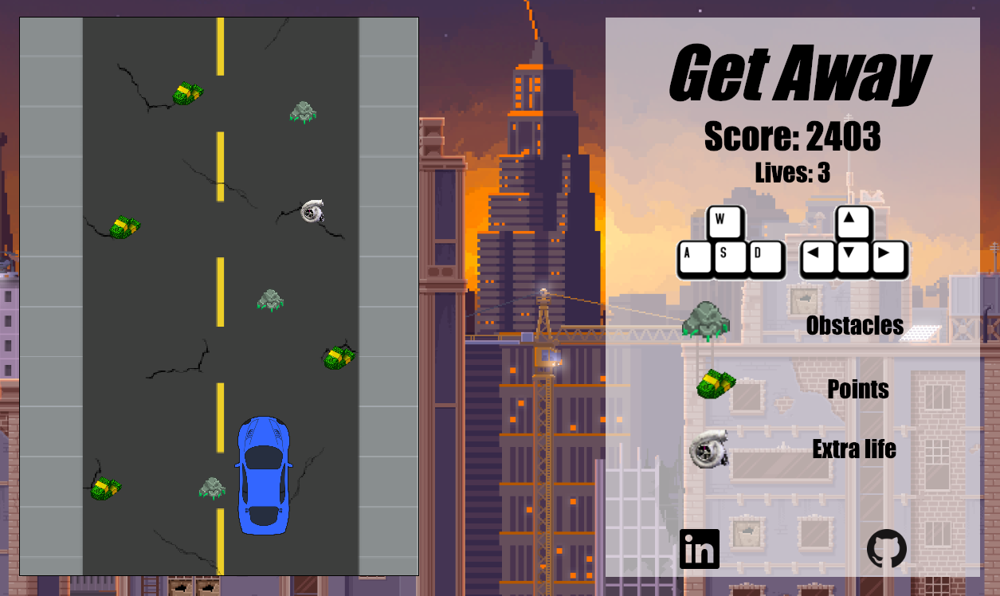

# Get Away

## Overview

[Get Away Live](https://le-s.github.io/getaway/)

Get Away is a top-down scrolling car game full of obstacles. Collect as much money as you can, while avoiding obstacles. Be careful! By hitting three obstacles the police will catch up to you in no time.

## Technologies Used
- JavaScript for overall structure and game logic
- HTML5 Canvas for rendering

## Features
- Users can choose to use directional arrows or WASD keys to maneuver their car away from obstacles
- There will be money on the ground for users to increase their score
- Obstacles load randomly on the road, increasing difficulty
- Player's have three lives before the cops catch up to them, user's can collect more lives by collecting turbos



## Highlights
Collision Detection
```js
collide(obj1, obj2) {
if (obj1.physics.x < obj2.physics.x + obj2.sprite.width
  && obj1.physics.x + obj1.sprite.width > obj2.physics.x
  && obj1.physics.y < obj2.physics.y + obj2.sprite.height
  && obj1.physics.y + obj1.sprite.height > obj2.physics.y
) return true;

return false;
}
```


Infinite road rendering
```js
if (asset instanceof Road && asset.physics.y >= 0) {
  if (sprite.height > canvas.height) {
    if (asset.physics.y > (canvas.height)) {
      asset.physics.y = canvas.height - sprite.height;
    }

    this.ctx.drawImage(sprite.img, 0, 0, sprite.width, sprite.height, asset.physics.x, asset.physics.y - sprite.height + 1, sprite.width, sprite.height);
  }
}
```